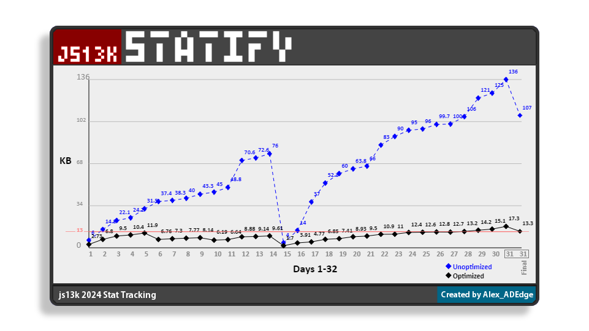

## js13k Statify

A web application/tool for tracking project stats throughout the duration of a gamejam or project (ie the js13k gamejam with its 13kb limit) and graphing progress/limitations.

Statify is custom app to visilize various points of data important to a data-limited gamejam or project. Intially it will display simple a simple graph, with more customized data visualization to be added in future as needed. 

Created by Alex Delderfield, July-August 2022, Updated during js13k 2024

Example data: 

 
